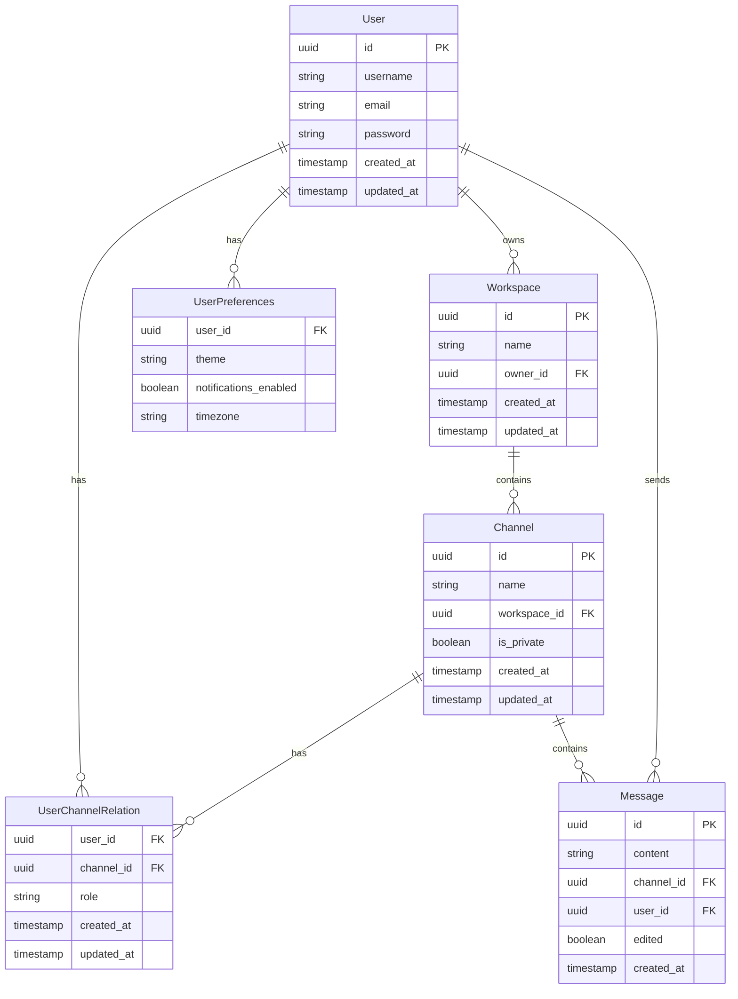

---

# Chat Application Backend

## Table of Contents
- [Overview](#overview)
- [Tech Stack](#tech-stack)
- [Project Structure](#project-structure)
- [Prerequisites](#prerequisites)
- [Installation](#installation)
- [Configuration](#configuration)
- [API Documentation](#api-documentation)
- [Database Schema](#database-schema)
- [Testing](#testing)
- [Deployment](#deployment)
- [Future Updates](#future-updates)
- [License](#license)
- [Contributing](#contributing)
- [Authors](#authors)

## Overview
A robust chat application backend that supports workspaces, channels, and direct messaging. The system includes features like user authentication, workspace management, channel operations, and message handling with role-based access control.

## Tech Stack
- **Node.js** & **Express.js**
- **PostgreSQL** (User management, Workspaces, Channels)
- **MongoDB** (Messages, Activity Logs)
- **Sequelize ORM**
- **Mongoose ODM**
- **JWT** for authentication
- **bcrypt** for password hashing
- **Socket.IO** for real-time communication
- Rate limiting and **CORS** configuration
- **Email service** integration

## Project Structure
```
backend/
├── config/
│   ├── databases/
│   │   ├── mongoconn.js    # MongoDB connection
│   │   └── postgreconn.js  # PostgreSQL connection
│   └── jwtConfig.js        # JWT configuration
├── controllers/
│   ├── authController.js       # Authentication logic
│   ├── channelController.js    # Channel management
│   ├── messageController.js    # Message handling
│   ├── userController.js       # User operations
│   └── workspaceController.js  # Workspace management
├── middleware/
│   ├── authMiddleware.js    # Authentication middleware
│   ├── catchAsyncErrors.js  # Error handling
│   ├── checkUserRole.js     # Role verification
│   ├── errorHandler.js      # Error handling
│   ├── rateLimiter.js       # Rate limiting
│   └── workspaceOwner.js    # Workspace ownership verification
├── models/
│   ├── activityLogsModel.js     # Activity tracking
│   ├── channelModel.js          # Channel schema
│   ├── messageModel.js          # Message schema
│   ├── passwordResetModel.js    # Password reset
│   ├── userModel.js             # User schema
│   ├── userPreferenceModel.js   # User preferences
│   └── workspaceModel.js        # Workspace schema
├── routes/
│   ├── authRoutes.js
│   ├── channelRoutes.js
│   ├── messageRoutes.js
│   ├── userRoutes.js
│   └── workspaceRoutes.js
├── services/
│   ├── EmailService.js         #email services
|   ├── socketIO.js             #socketIO services
│   └── jwtServices.js          # JWT operations
└── server.js                   # Application entry point
```

## Prerequisites
- **Node.js** >= 14.x
- **PostgreSQL** >= 13
- **MongoDB** >= 4.4
- **npm** or **yarn**

## Installation
```bash
# Clone the repository
git clone [repository-url]

# Install dependencies
npm install

# Set up environment variables
cp .env.example .env

# Run database migrations
npm run migrate

# Start the server
npm start
```

## Configuration
Create a `.env` file in the root directory with the following variables:
```env
# Server Configuration
PORT=3000
NODE_ENV=development
FRONTEND_URL=http://localhost:5173

# PostgreSQL Configuration
PG_HOST=localhost
PG_PORT=5432
PG_DB=your_database
PG_USER=your_username
PG_PASSWORD=your_password

# MongoDB Configuration
MONGO_URI=mongodb://localhost:27017/your_database

# JWT Configuration
JWT_SECRET_KEY=your_secret_key
JWT_EXPIRE=7d
COOKIE_EXPIRE=7

# Google OAuth
GOOGLE_CLIENT_ID=your_google_client_id
GOOGLE_CLIENT_SECRET=your_google_client_secret

# Email Configuration
SMTP_HOST=your_smtp_host
SMTP_PORT=587
SMTP_USER=your_email
SMTP_PASS=your_password
```

## API Documentation

### Authentication
- `POST /api/v1/auth/register`: Register a new user
- `POST /api/v1/auth/login`: Login user
- `POST /api/v1/auth/google`: Google OAuth login
- `POST /api/v1/auth/logout`: Logout user
- `POST /api/v1/auth/forgot-password`: Request password reset
- `PUT /api/v1/auth/reset-password/:token`: Reset password

### User Management
- `PUT /api/v1/user/change-password`: Change password
- `PUT /api/v1/user/me`: Update profile
- `GET /api/v1/user/me`: Get current user
- `DELETE /api/v1/user/me`: Delete current user
- `GET /api/v1/user/pref`: Get user preferences
- `PUT /api/v1/user/pref`: Update user preferences

### Workspace & Channel Management
- `POST /api/v1/workspace`: Create workspace
- `GET /api/v1/workspace`: Get all workspaces
- `PUT /api/v1/workspace/:workspaceId`: Update workspace
- `DELETE /api/v1/workspace/:workspaceId`: Delete workspace
- `POST /api/v1/workspace/:workspaceId/channel`: Create channel
- `GET /api/v1/workspace/:workspaceId/channel`: Get all channels

### Channel Membership
- `POST /api/v1/workspace/:workspaceId/channel/:channelId`: Add members
- `GET /api/v1/workspace/:workspaceId/channel/:channelId`: Get members
- `DELETE /api/v1/workspace/:workspaceId/channel/:channelId/member`: Remove members
- `DELETE /api/v1/workspace/:workspaceId/channel/:channelId/leave`: Leave channel
- `PUT /api/v1/workspace/:workspaceId/channel/:channelId/:memberId`: Update member role

### Messages
- `POST /api/v1/workspace/:workspaceId/channel/:channelId/messages`: Send message
- `GET /api/v1/workspace/:workspaceId/channel/:channelId/messages`: Get channel messages
- `PUT /api/v1/workspace/:workspaceId/channel/:channelId/messages/:messageId`: Edit message
- `DELETE /api/v1/workspace/:workspaceId/channel/:channelId/messages/:messageId`: Delete message

## Database Schema




## Testing
A Postman collection is available to simplify API testing. Download the collection [here](/gdscSlack.postman_collection.json) and import it into Postman to test various endpoints.

### Running Tests
```bash
# Run unit tests
npm run test

# Run integration tests
npm run test:integration

# Generate test coverage report
npm run test:coverage
```

## Deployment
Provide deployment instructions depending on the environment (e.g., Docker, cloud platforms). Add configuration files and setup scripts if necessary.

## Future Updates
### Planned Features
1. **Real-time Communication**:
   - WebSocket integration for real-time messaging
   - Typing indicators, read receipts, and presence indicators
2. **Live Calling**:
   - Voice call support within workspaces and channels
3. **Video Calling**:
   - Real-time video communication within channels
4. **Enhanced Message Features**:
   - File attachments, message threading, reactions, search, and pinning
5. **Channel Enhancements**:
   - Channel categories, archiving, private thread support, and search functionality
6. **User Experience**:
   - Status management, profile customization, activity logs, and enhanced notifications
7. **Authentication & Security**:
   - Multi-factor authentication, session management,

 and admin control for workspace owners

## License
Distributed under the MIT License. See `LICENSE` for more information.

## Contributing
Feel free to fork the project and submit pull requests. Please follow the guidelines in `CONTRIBUTING.md`.

## Authors
- **Bhavya Mittal** - [GitHub](https://github.com/MITTALBHAVYA)

---