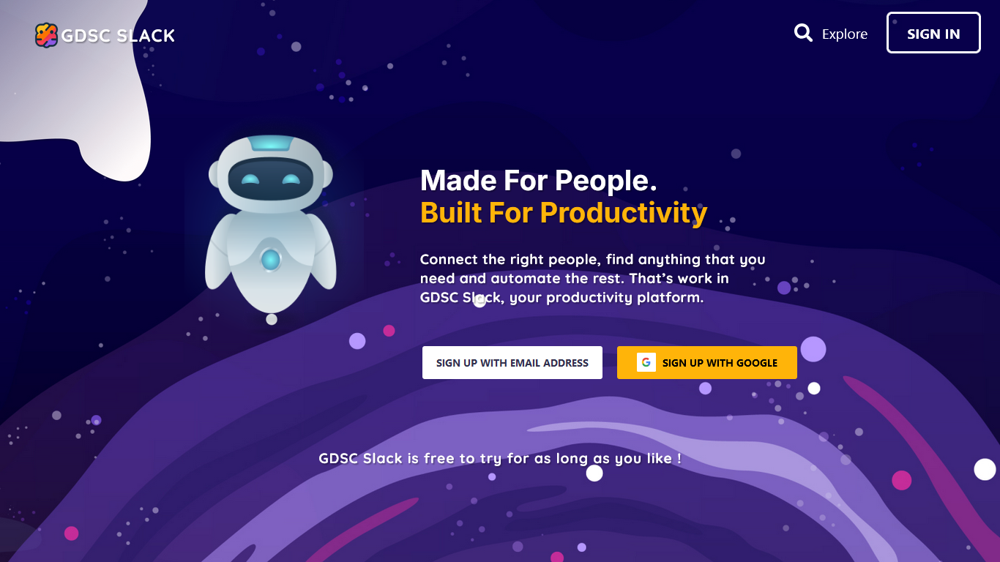
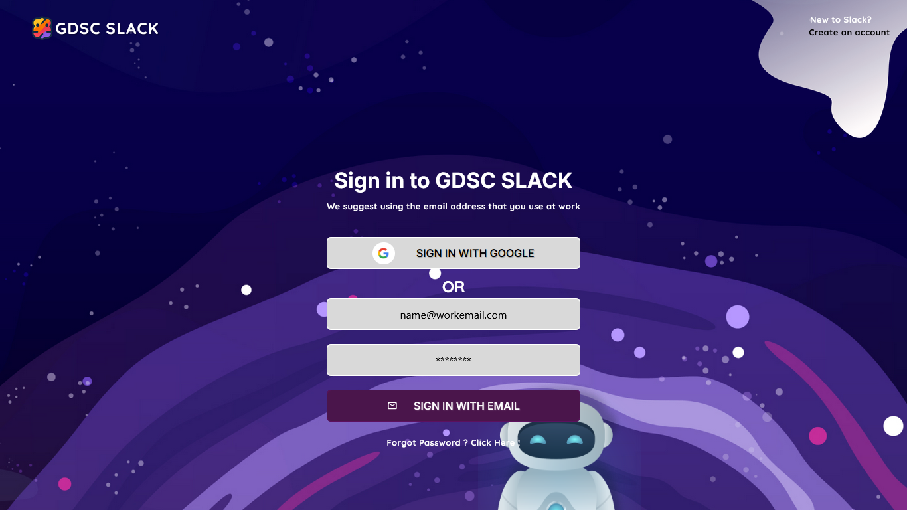
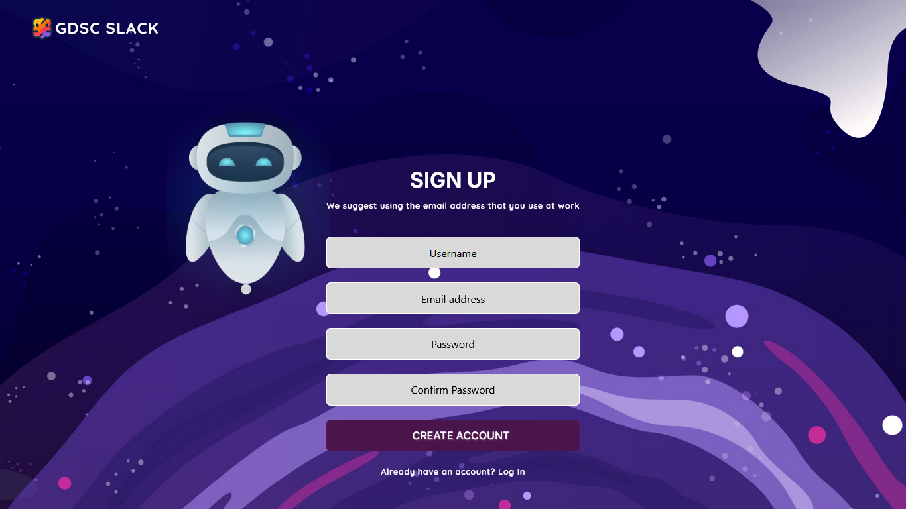
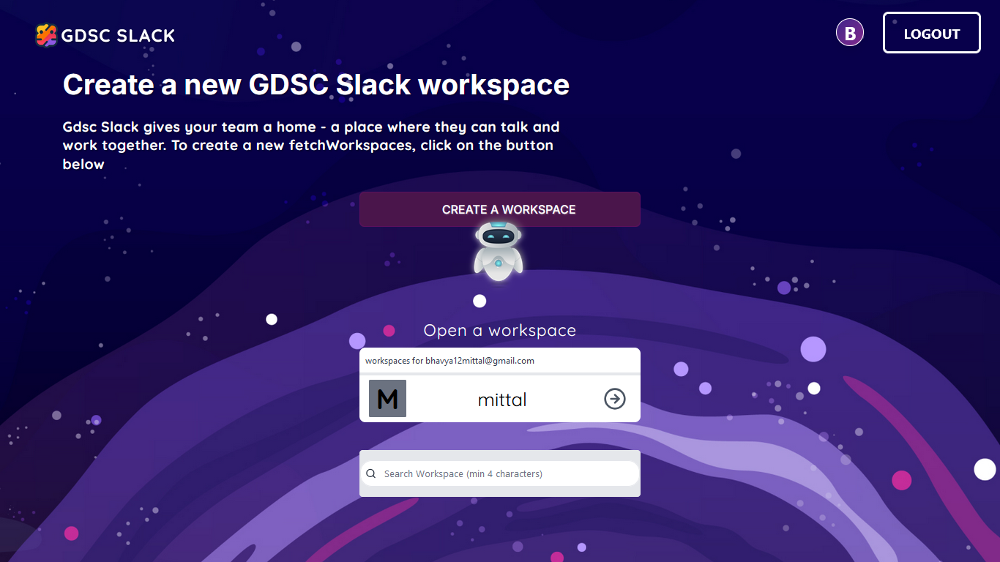
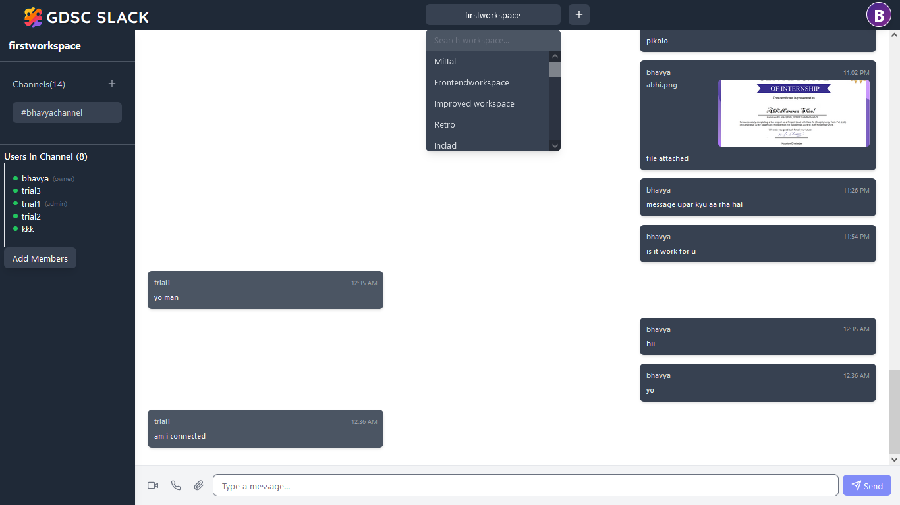

# GDSC Slack - Frontend

## 📌 Project Overview
The frontend is built using React, Redux, and modern web technologies to provide a seamless communication experience.

## 🖼️ Screenshots

### Landing Page


### SIGNIN Page


### Sign Up Page


### Workspace Page


### Chat Page


## 🚀 Features

- User Authentication (Login, Register, Google OAuth)
- Workspace Creation and Management
- Real-time Chat Functionality
- Channel Creation and Management
- User Profile Management
- Responsive Design

## 🛠️ Technologies Used

- **Frontend Framework**: React 18
- **State Management**: Redux Toolkit
- **Routing**: React Router
- **Styling**: Tailwind CSS
- **Authentication**: JWT, Google OAuth
- **Real-time Communication**: Socket.IO
- **HTTP Client**: Axios
- **Build Tool**: Vite

## 📦 Project Structure

```
frontend/
│
├── public/
│   └── images/
│
├── src/
│   ├── api/
│   │   └── axios.js
│   ├── app/
│   │   └── store.js
│   ├── assets/
│   ├── components/
│   │   ├── auth/
│   │   ├── chat/
│   │   ├── layout/
│   │   └── workspace/
│   ├── features/
│   │   └── slices/
│   ├── hooks/
│   ├── pages/
│   ├── services/
│   ├── App.jsx
│   └── main.jsx
│
├── .env
├── package.json
└── vite.config.js
```

## 🔧 Environment Setup

1. Clone the repository
   ```bash
   git clone https://github.com/MITTALBHAVYA/slack-GDSC-Mycut
   cd gdsc-slack-clone/frontend/vite-project
   ```

2. Install dependencies
   ```bash
   npm install
   ```

3. Set up environment variables
   Create a `.env` file in the root directory with the following variables:
   ```
   VITE_API_URL=http://localhost:3000
   VITE_SOCKET_URL=http://localhost:3000
   VITE_PORT=5173
   VITE_GOOGLE_CLIENT_ID=your_google_client_id
   ```

## 🏃 Running the Application

- Development Mode
  ```bash
  npm run dev
  ```

- Build for Production
  ```bash
  npm run build
  ```

- Preview Production Build
  ```bash
  npm run preview
  ```

## 🧪 Testing

- Linting
  ```bash
  npm run lint
  ```

## 🤝 Contributing

1. Fork the repository
2. Create your feature branch (`git checkout -b feature/AmazingFeature`)
3. Commit your changes (`git commit -m 'Add some AmazingFeature'`)
4. Push to the branch (`git push origin feature/AmazingFeature`)
5. Open a Pull Request

## 📝 License

Distributed under the MIT License. See `LICENSE` for more information.

## 📞 Contact

Your Name - [bhavya12mittal@gmail.com]

Project Link: [https://github.com/MITTALBHAVYA/slack-GDSC-Mycut](https://github.com/MITTALBHAVYA/slack-GDSC-Mycut)
## 🌟 Support
Give a ⭐ if this project helps you!